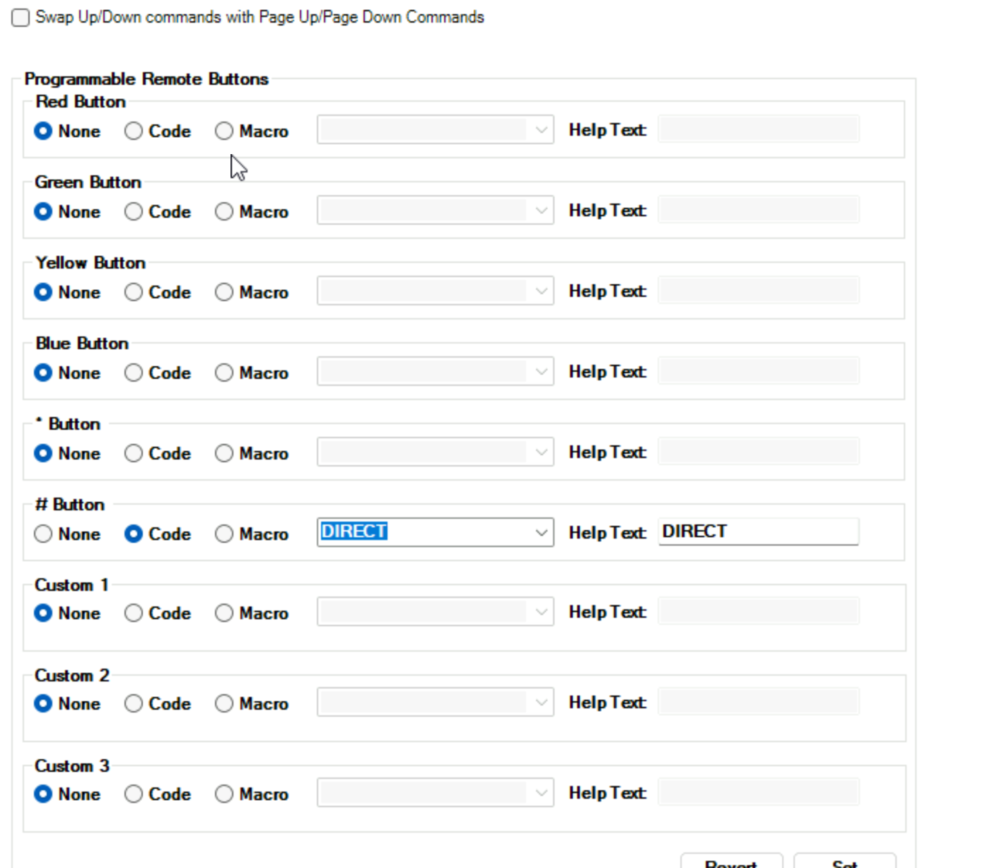

# C4-SiriusXM-EZR

A simple Control4 IR driver for the SiriusXM Onyx EZR. While most users will prefer internet streaming, this driver is ideal for:

- Grandfathered SiriusXM accounts  
- Dealer trial units  
- Scenarios with unstable internet connections  

It allows continued access to SiriusXM content via IR control.

This driver can also be combined with **Source Pooling** for setups with multiple devices:  
[Source Pooling on DriverCentral](https://drivercentral.io/platforms/control4-drivers/audio-video/source-pooling/)

> **Note:**  
> Power controls are not included. The SiriusXM EZR unit is assumed to always be powered on to avoid desynchronization between the device state and Control4.

---

## Settings

In the driver settings, map the **Pound `#` key** to **Direct**.

To change channels via a remote or touchscreen, use the `#channel` format — for example: #46 to tune to channel 46 (The Heat)

Channel up/down and menu/navigation functions are fully supported.
